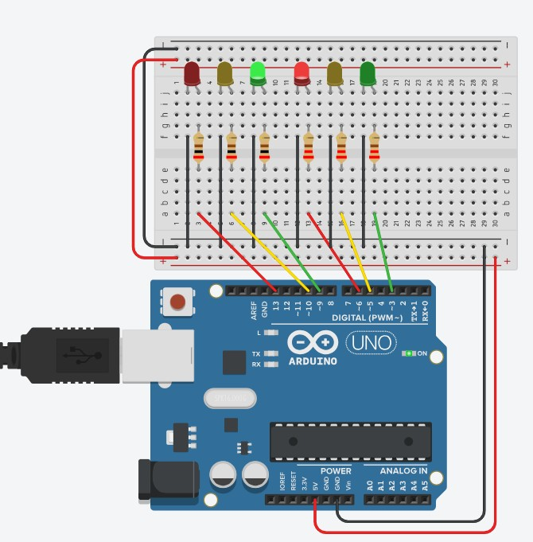

# 🚦 Farol com Arduino Uno



## 📋 Descrição

Simulação de um farol de trânsito utilizando LEDs coloridos controlados pelo Arduino Uno. O sistema aciona os LEDs em sequência — vermelho, amarelo e verde — reproduzindo o ciclo padrão de um semáforo/farol de trânsito.

---

## 🧰 Componentes Utilizados

| Componente         | Quantidade |
|--------------------|------------|
| Arduino Uno        | 1          |
| LED Vermelho       | 2          |
| LED Amarelo        | 2          |
| LED Verde          | 2          |
| Resistor 220Ω      | 6          |
| Protoboard         | 1          |
| Jumpers            | Vários     |

---

## 🔌 Conexões

Os LEDs são conectados aos pinos digitais do Arduino através de resistores de 220Ω para limitação de corrente. O GND dos LEDs é ligado ao GND do Arduino, e o positivo da protoboard é conectado ao 5V do Arduino.

| LED             | Pino Digital Arduino |
|-----------------|----------------------|
| Vermelho 1      | 13                   |
| Vermelho 2      | 12                   |
| Amarelo 1       | 8                    |
| Amarelo 2       | 7                    |
| Verde 1         | 4                    |
| Verde 2         | 3                    |

> Os valores exatos dos pinos podem variar — consulte o arquivo `main.cpp` para a configuração definitiva.

---

## ⚙️ Funcionamento

O programa aciona os LEDs em sequência cíclica, simulando as fases de um farol:

1. **Vermelho** aceso → sinal de parada
2. **Amarelo** aceso → sinal de atenção
3. **Verde** aceso → sinal de passagem

Cada fase é mantida por um intervalo de tempo definido no código antes de avançar para a próxima.

---

## 💻 Código

O código-fonte está disponível no arquivo [`main.cpp`](main.cpp), escrito em **C++** para Arduino.

---

## 🛠️ Como Simular

1. Acesse [Tinkercad Circuits](https://www.tinkercad.com/)
2. Importe ou monte o circuito conforme o esquema acima
3. Carregue o código `main.cpp` no editor do Tinkercad
4. Clique em **"Iniciar Simulação"**

---

## 📁 Estrutura do Repositório

```
📦 farol-arduino
 ┣ 📄 main.cpp
 ┣ 📄 README.md
 ┗ 🖼️ farol123.jpg
```
